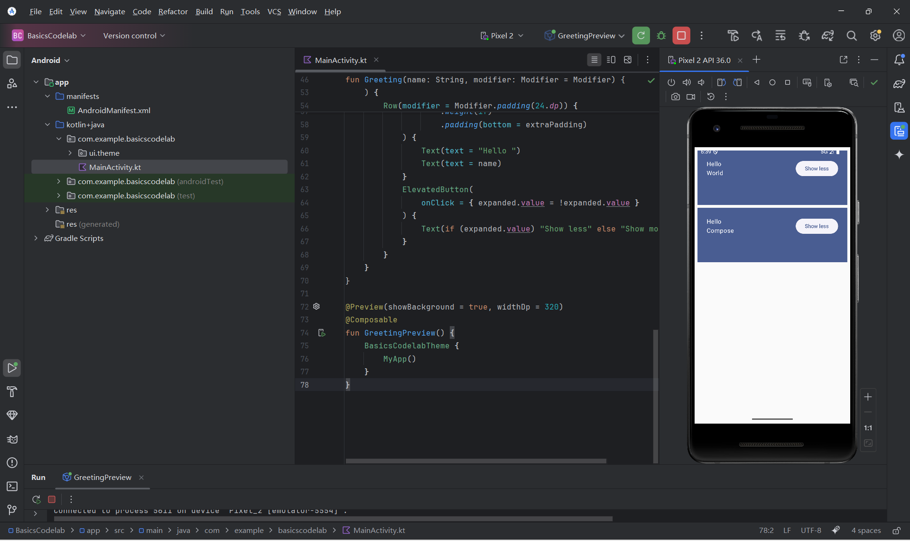
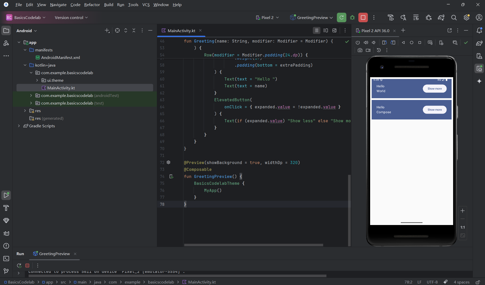

# BasicsCodelab

一个基于 **Android Jetpack Compose** 的基础示例项目，展示了现代Android UI开发的核心概念和最佳实践。

##  项目概述

本项目是一个学习Jetpack Compose的入门级示例，演示了如何使用Compose构建交互式UI界面，包括状态管理、布局组件和Material Design 3主题系统。

## 技术栈

| 技术 | 版本 | 说明 |
|------|------|------|
| Kotlin | 1.9+ | 主要开发语言 |
| Jetpack Compose | 1.6+ | Android现代UI工具包 |
| Material Design 3 | 1.2+ | 最新Material Design设计规范 |
| Android Studio | Hedgehog | 推荐开发环境 |

## 功能特性

-  **响应式状态管理**：使用 `remember` 和 `mutableStateOf` 实现UI状态响应
-  **Material Design 3主题**：支持明暗主题切换和动态色彩
-  **响应式布局**：使用 `Column` 和 `Row` 构建灵活的UI布局
-  **交互效果**：按钮点击展开/收起动画效果
- **预览功能**：支持Android Studio预览面板实时预览

##  快速开始

### 环境要求

- Android Studio Hedgehog (2023.1.1) 或更高版本
- JDK 17+


### 运行步骤

1. **克隆项目**
   ```bash
   git clone <repository-url>
   cd BasicsCodelab
   ```

2. **打开项目**
   - 启动 Android Studio
   - 选择 `File > Open`，选择项目根目录

3. **构建项目**
   - 等待Gradle同步完成
   - 点击工具栏中的 `Sync Project with Gradle Files`

4. **运行应用**
   - 连接Android设备或启动模拟器
   - 点击 `Run` 按钮（绿色三角形图标）

##  项目结构

```
BasicsCodelab/
├── app/                           # 应用模块
│   ├── src/
│   │   ├── main/
│   │   │   ├── java/com/example/basicscodelab/
│   │   │   │   ├── MainActivity.kt      # 主活动入口
│   │   │   │   └── ui/theme/           # 主题配置
│   │   │   │       ├── Color.kt        # 颜色定义
│   │   │   │       ├── Theme.kt        # 主题实现
│   │   │   │       └── Type.kt         # 字体样式
│   │   │   └── res/                    # 资源文件
│   │   │       ├── drawable/           # 矢量图资源
│   │   │       ├── mipmap-*/          # 应用图标
│   │   │       ├── values/             # 字符串、颜色、主题配置
│   │   │       └── xml/                # 配置文件
│   │   ├── androidTest/               # 仪器化测试
│   │   └── test/                      # 单元测试
│   ├── build.gradle.kts               # 模块构建配置
│   └── proguard-rules.pro             # 混淆规则
├── gradle/                            # Gradle配置
│   └── wrapper/                       # Gradle Wrapper
├── build.gradle.kts                   # 项目构建配置
├── gradle.properties                  # Gradle属性
└── settings.gradle.kts                # 项目设置
```

##  核心代码解析

### 1. 主活动入口

```kotlin
class MainActivity : ComponentActivity() {
    override fun onCreate(savedInstanceState: Bundle?) {
        super.onCreate(savedInstanceState)
        setContent {
            BasicsCodelabTheme {
                MyApp(modifier = Modifier.fillMaxSize())
            }
        }
    }
}
```

- 使用 `setContent` 函数设置Compose内容
- 应用自定义主题 `BasicsCodelabTheme`

### 2. 状态管理示例

```kotlin
@Composable
fun Greeting(name: String, modifier: Modifier = Modifier) {
    val expanded = remember { mutableStateOf(false) }
    val extraPadding = if (expanded.value) 48.dp else 0.dp
    
    // UI组件会自动响应expanded状态变化
}
```

- `remember`：在重组期间保持状态
- `mutableStateOf`：创建可观察的状态对象
- 状态变化会自动触发UI重组

### 3. Material Design 3主题

```kotlin
@Composable
fun BasicsCodelabTheme(
    darkTheme: Boolean = isSystemInDarkTheme(),
    dynamicColor: Boolean = true,
    content: @Composable () -> Unit
) {
    val colorScheme = when {
        dynamicColor && Build.VERSION.SDK_INT >= Build.VERSION_CODES.S -> {
            // Android 12+ 动态色彩
            if (darkTheme) dynamicDarkColorScheme(context) 
            else dynamicLightColorScheme(context)
        }
        darkTheme -> DarkColorScheme
        else -> LightColorScheme
    }
    MaterialTheme(colorScheme = colorScheme, typography = Typography, content = content)
}
```

- 支持系统主题自动检测
- Android 12+ 支持动态色彩提取
- 完整的明暗主题切换支持

##  关键概念

| 概念 | 说明 |
|------|------|
| **Composable** | 使用 `@Composable` 注解标记的函数，用于构建UI |
| **State** | UI状态，使用 `mutableStateOf` 创建，状态变化触发重组 |
| **Modifier** | 用于修饰Compose组件，如padding、size、alignment等 |
| **Recomposition** | Compose的核心机制，根据状态变化自动更新UI |
| **Preview** | 使用 `@Preview` 注解在Android Studio中预览UI |


##  运行结果




> **说明**：应用启动后，显示两个问候卡片，点击 "Show more" 按钮可以展开卡片显示更多内容，点击 "Show less" 则收起。卡片使用Material Design 3的Surface组件，具有阴影效果和圆角设计。
